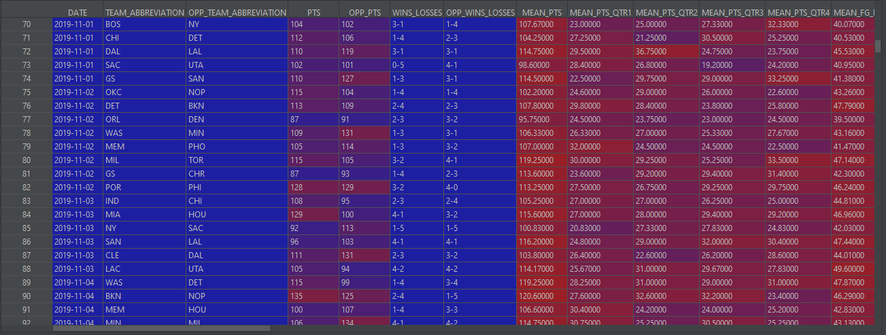

# Web Scraping NBA Season 2019/20

## Purpose
 Get a data from all NBA 2019/20 gamess so far and build a dataset for analyse.

 ## Description

 DATE = date of the game  
 TEAM_ABBREVIATION = home team abreviation  
 OPP_TEAM_ABBREVIATION = away team abreviation  
 PTS = home team points at the end of the game  
 OPP_PTS = away team points at the end of the game  
 WINS_LOSSES = home team Wins/Losses at season so far  

 OPP_WINS_LOSSES = away team Wins/Losses at season so far  
 ODDS_ML_OPENING = home team win moneyline odds from OPENING  
 ODDS_ML_BOGDOG = home team win moneyline odds from BOGDOG  
 ODDS_ML_BUMBET = home team win moneyline odds from BUMBET  
 ODDS_ML_BETONLINE = home team win moneyline odds from BETONLINE  
 ODDS_ML_INTERTOPS = home team win moneyline odds from INTERTOPS  
 OPP_ODDS_ML_OPENING = away team win moneyline odds from OPENING  
 OPP_ODDS_ML_BOGDOG = away team win moneyline odds from BOGDOG  
 OPP_ODDS_ML_BUMBET = away team win moneyline odds from BUMBET  
 OPP_ODDS_ML_BETONLINE = away team win moneyline odds from BETONLINE  
 OPP_ODDS_ML_INTERTOPS = away team win moneyline odds from INTERTOPS  

 MEAN_PTS = home team average points per game  
 MEAN_PTS_QTR1 = home team average first quarter points per game  
 MEAN_PTS_QTR2 = home team average second quarter points per game  
 MEAN_PTS_QTR3 = home team average third quarter points per game  
 MEAN_PTS_QTR4 = home team average fourth quarter points per game  
 MEAN_FG_PCT =  home team average field goal per game  
 MEAN_FT_PCT = home team average free throw per game  
 MEAN_FG3_PCT = home team average 3 points per game  
 MEAN_AST = home team average assistance per game  
 MEAN_REB = home team average rebounds per game  
 MEAN_TOV = home team average tornouvers per game  
 OPP_MEAN_PTS = away team average points per game  
 OPP_MEAN_PTS_QTR1 = away team average first quarter points per game  
 OPP_MEAN_PTS_QTR2 = away team average second quarter points per game  
 OPP_MEAN_PTS_QTR3 = away team average third quarter points per game  
 OPP_MEAN_PTS_QTR4 = away team average fourth quarter points per game  
 OPP_MEAN_FG_PCT =  away team average field goal per game  
 OPP_MEAN_FT_PCT = away team average free throw per game  
 OPP_MEAN_FG3_PCT = away team average 3 points per game  
 OPP_MEAN_AST = away team average assistance per game  
 OPP_MEAN_REB = away team average rebounds per game  
 OPP_MEAN_TOV = away team average tornouvers per game  

## Exemple

